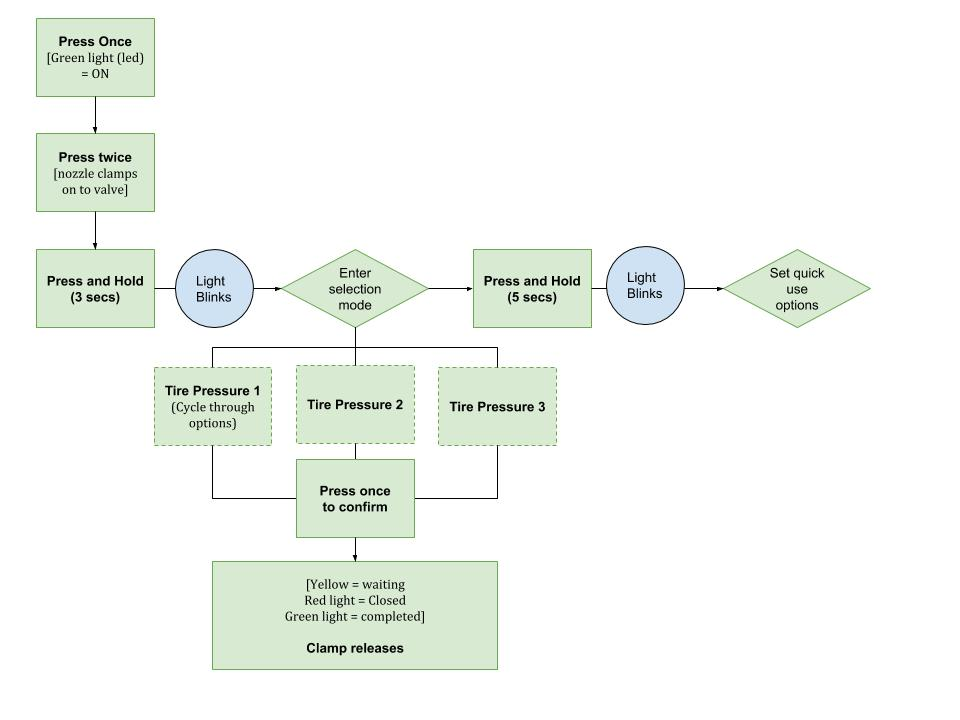
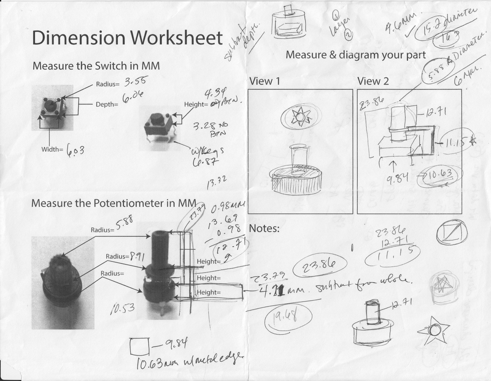

# CIM542-642

## Week 1

### Unicorn Closet

This is the Unicorn of closets. It will help you pack, get you dressed, Marie Kondo your way to savings because you really don't love those black pants anymore. For the purpose of this assignment, I focused on how this magical closet helps you pack your suitcase or any bag. Based on your inputs (screen-based) it will help select your clothes and if needed, give you room to do some shopping.

Thinking, thinking, thinking … I used to feel like I needed to draw as a designer but I'm finding that words are just as useful.

So this closet uses a screen interaction which probably doesn't fit the physical computing aspect of the project but I thought about inputs and outputs just the same.  The interactions are also based on having geolocation and other "auto" features to make the inputs easier (read: minimal touching, typing, etc.)

I didn't think too much about how the clothes get into the suitcase (because its magic) but that would be a big next step if I ever wanted to make this a reality - in another universe.

1. User touches screen to turn it on (lights up). When in the off position, the screen is glowing some relaxing colors.

2. User inputs the following
* Dates of travel
* Location (weather info downloaded)
* Activities: Select from choices and input others
* Transportation: Airline / Train / Car / Bus (auto download information e.g. flight details)
* Query: Will the user be shopping?

3. Add the bag or suitcase to the slideout. Lights and audio also provide feedback based on the weight sensor.

4. Confirmation of selections

5. Suitcase/Bag and the outfit guide is ready.

My favorite part about this magical closet (I'm allowed to love my idea, right?) is that it provides you with a printout (or a digital note) of how to mix and match the items it has packed for you.

## Week 2

### Arduino Space Ship

OK, this was fun. I did have some issues:
* In the code, I had a capital "I" on my "if"
* The power wire from the switch to the Arduino was in the wrong pin

That took me awhile to figure out but I did - yay me.

#### Space Ship Videos

[Space Ship circuitry](https://youtu.be/OhQqHxNC8L4)

[Space Ship with a fancy cover](https://youtu.be/yc8WKyt32UQ)

#### Photos

Here is the [finished code](https://github.com/dpd28/CIM542-642/blob/master/Space_On_jan30a/sketch_jan30a/sketch_jan30a.ino)

## Week 3

### One Button

## Week 4

### Love-o-Meter

[Love-o-Meter exercise](https://youtu.be/DOpJ4ziAJs0)

This was fun. I got it to work and while the heat wasn't significant, it was enough to get the LEDs to change.

### Color Mixing Lamp

[Color Mixing Lamp exercise](https://youtu.be/JNj60dFvf-8)

For this exercise I really wish there had been the parts that would hold the filters on the photo sensors. I got a pink to purple color light and would liked to have seen more variety but something wasn't working; not sure yet what after trying different things … I tried this with shining my bike light but wasn't sure if anything was actually different.

## Week 5

No Homework

## Week 6

### Sensory Walk

I chose to track and observe people as I walked around campus and during activities. One interaction was done at my apartment building. The number of interactions are many so I chose to focus on physical interactions since screen-based interaction are difficult to observe from a distance. Most of the interactions are active and provide visible or auditory feedback.

[Here's a breakdown of what I observed](https://github.com/dpd28/CIM542-642/blob/master/SensoryWalkThrough/SensoryWalk.md) and what I believe to be the inputs, outputs and types of sensors used. I had a challenging time trying to match sensors.

### Knock Lock

## Week 7

## Week 8

## Week 9  - SPRING break

## Week 10

Check out my [midterm project here](https://dpd28.github.io/CIM542-642/midtermS19/) in more detail.

## Week 11 - 3D Printer and OnShape

This assignment to use OnShape and the 3D printer was challenging for me. I think because it is hard for me learn software and understand concept at the same time? Hmm… All I know is that when my shape was finally printed, I understood what others were making and how I could have pushed things a bit further.

My idea was to have the white part stick out because it seemed to be the only way anyone would be able to turn the knob. *Hello* I just didn't  *get* how to create a shape that wouldn't be a barrier but now I understand that there needed to be an inside shape that would fit perfectly over the knob so a person could turn it; kinda like an oven mitt that isn't shaped like your hand.

### OnShape

I still think this software isn't intuitive but apparently it is better than most which is a scary thought.

The mini "box" for the switch button. I think this was printed in class and I lost it.

OK this was hard for me to grasp. My first attempt was hilarious because apparently I had made it too large and it would take **8 hours to print**! THat's the first sign I knew I had done something wrong. I had also made too many pieces separately. *Sign* Thankfully Zeven was around to help.

### Printed Pieces

For size.

The bottom fits!

But the hole in the top of the shape does not. Disappointed but think its cool at the same time. Alas, I lost my switch printed piece and that didn't fit either so at least now I need to make the dimensions just a tad bit larger.

## Week 12 - Make

## Week 13 - Make

## Week 14 - Make

## Week 15 - Final!

The documentation for [my final project](https://dpd28.github.io/CIM542-642/dpdFinal/).
